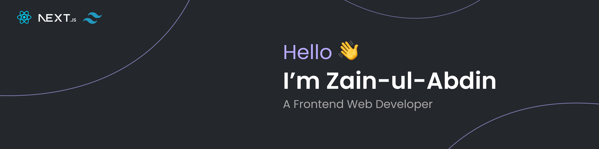

 

Hello there! <strong>I'm Zain-ul-Abdin</strong>, a curious explorer deeply immersed in the world of web development. My compass is set towards creating exceptional digital experiences that leave a mark.

I am excited to connect with fellow web developers, professionals, and mentors. Whether you're offering guidance, seeking collaboration, or have an opportunity that aligns with my aspirations, I'd love to hear from you. Let's learn and grow together in the ever-evolving world of web development!

<h2>Language & Tools: ⚙️</h2>

